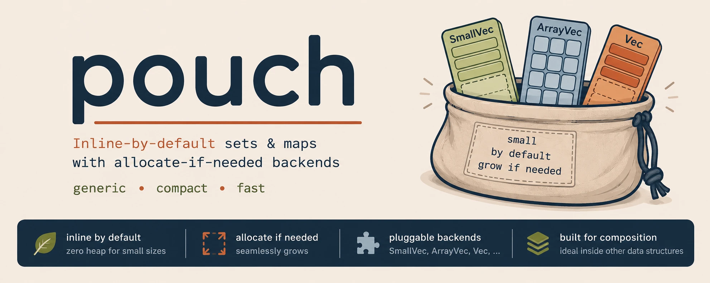

<p align="center">
  
</p>

# pouch

[](https://github.com/qkniep/pouch/actions/workflows/rust.yml)
[](#license)

**Flat, allocation-avoiding sets and maps for Rust — small collections stay inline until they outgrow `N`.**

Built for the case most collection crates ignore: **many small collections nested
in a larger structure** — a `Vec` of adjacency lists, inverted-index postings,
per-key buckets, quorum / vote / share sets. A population of thousands of small
sets then costs roughly *one* heap allocation instead of one per set, because the
default `Set` / `Map` keep their elements **inline** until they outgrow `N`.

Under the hood every collection is **backend-generic**: the same set/map logic runs
over a `Vec`, `SmallVec`, `TinyVec`, `ArrayVec`, `heapless::Vec`, or a **borrowed**
slice or buffer (`&[T]`, `ScratchVec`) — heap, inline, hybrid, or borrowed — and
stores compose: `Capped` adds a runtime bound to any store, `Spill` chains two
tiers. And since the core never touches an allocator, the same collections run
unchanged on `no_std` and embedded targets.

> [!NOTE]
> **Early days — the API is not yet stable.** The store traits are still
> settling; expect breaking changes between 0.x releases. The collection layer
> is filling in: bulk constructors, an `Entry` API, borrowed-key lookups, set
> algebra, `Hash`/`Ord` on the sorted flavors, and `serde` behind a feature.
> Comparators are next.

## Benchmarks

Apple M4 Max, rustc 1.96, `cargo bench` — illustrative, re-run on your own hardware.
**Bold** = best. Full matrix (population, sets, maps, fixed-cap, backend sweep) in
[BENCHMARKS.md](BENCHMARKS.md).

**The headline — a `Vec` of 10 000 small sets** (heavy-tailed: ~99% hold 1–4
elements, ~1% are hubs of 64–1024). Building the whole population, `peak allocations`
and memory from divan's allocation profiler:

| inner set                  | allocations | memory      | lookup    |
| -------------------------- | ----------: | ----------: | --------: |
| `pouch::Set` (inline, N=4) | **105**     | **1.10 MB** | 28 µs     |
| pouch over `Vec`           | 10 001      | 1.18 MB     | **24 µs** |
| `HashSet`                  | 10 001      | 1.93 MB     | 139 µs    |
| `BTreeSet`                 | 17 980      | 2.20 MB     | 70 µs     |

~95× fewer allocations, the lowest memory, and ~5× faster lookups than `HashSet`.
Two honest caveats: `N` is a memory knob — `N=4` (tuned to the 1–4 body) is shown;
`N=16` keeps the 105 allocations but uses 2.06 MB, and the default `Set` is `N=8`,
between. And the lookup win is the *sorted-small-set* property (both pouch backends
have it), not inline specifically — inline's unique, decisive win is allocation count.

Beyond the headline, [BENCHMARKS.md](BENCHMARKS.md) covers single-collection maps,
set iteration, the SoA column maps, bulk-construction strategies, and a backend
sweep. The short version:

- **Nested populations are the win** (table above): inline storage collapses a
  population of small sets to ~one allocation, which `Vec<HashSet>` /
  thincollections can't — they allocate per inner set regardless.
- **Parity with litemap** on the shared sorted-`Vec` design — the backend-generic
  layer costs nothing; flat binary search beats `BTreeMap` and SipHash `HashMap` on
  lookups, while a fast hasher (`FxHashMap`) overtakes past `n ≈ 16`.
- **Bulk construction** (`try_from_iter` / `from_sorted_iter`) beats an insert-loop
  by ~8× / ~58× at `n = 1024`, and **iteration** over contiguous memory runs
  ~10–50× faster than the tree/hash maps.

## Example

```rust
use pouch::Set;

// `Set`/`Map` keep small contents inline (no allocation), spilling past `N`.
let mut s: Set<u64> = Set::default();
s.insert(5);
s.insert(1);
s.insert(5); // duplicate, ignored
assert_eq!(s.as_slice(), &[1, 5]); // sorted, inline
assert!(s.contains(&1));

// The point: a population of small sets is ~one allocation, not one per set.
let mut adjacency: Vec<Set<u32>> = (0..1000).map(|_| Set::default()).collect();
adjacency[0].insert(7);
adjacency[0].insert(3);
```

Also available: an `Entry` API (`map.entry(k).or_insert(0)` — insert-or-update in one
lookup), fallible `try_insert` on bounded stores (hands the element back instead of
allocating), bulk constructors (`try_from_iter` sorts + dedups once, `from_sorted_iter`
skips the sort), merge-based set algebra (`union` / `intersection` / `is_subset`,
`O(n + m)` and cross-backend), and the `Unsorted` variants (`O(1)` append + swap-remove
for elements cheap to scan or not `Ord`).

## Design

Three concerns that other small-collection crates usually fuse are kept
orthogonal, so you mix them freely:

- **storage** — *where* elements live (heap / inline / hybrid): the `Store` trait
  family, implemented once per backend.
- **bound** — the maximum logical element count, reported by
  `Store::max_capacity() -> Option<usize>`. A runtime bound is added with the
  `Capped<S>` wrapper rather than per backend.
- **ordering** — sorted (`SortedSet`/`SortedMap`) vs unsorted
  (`UnsortedSet`/`UnsortedMap`). Sorted keeps `O(log n)` lookup; unsorted trades it
  for `O(n)` lookup but gains `O(1)` structural mutation and needs only `Eq`, not
  `Ord`. This lives in the collection layer; the stores are ordering-agnostic.

In short: **sorted** wins lookups; **unsorted** wins when `n` is small or elements
aren't `Ord`. The asymptotics are backend-independent — every store is a contiguous
array, so the backend changes only the constant factor (see [Benchmarks](#benchmarks)),
never the order.

The default `Set` / `Map` fix the combination this crate is tuned for — sorted,
`SmallVec`-backed (inline), unbounded — so the nested-population win is the path of
least resistance. Swap any axis (a `Vec` for one big collection, `heapless` for
`no_std`, unsorted when elements aren't `Ord`) when your case differs. A fourth,
invariant-free shape rounds out the lineup: `Bag`, a `Vec`-like sequence
(duplicates kept, no ordering, no element bounds) that gives *composed* stores —
`Bag<Capped<Vec<T>>>` is a capped vector — an ergonomic push/pop API.

**Struct-of-arrays layout (`soa` feature: `UnsortedColumnMap` / `SortedColumnMap`).**
A map can instead keep keys and values in *two* parallel stores, so a lookup scans
(`UnsortedColumnMap`) or binary-searches (`SortedColumnMap`) a dense key column
without dragging values through cache. Niche enough that the array-of-structs
`UnsortedMap` / `SortedMap` stay the default; reach for a column map when lookups
dominate, especially with big values. See [Benchmarks](#benchmarks).

## Backends

Storage and bound are orthogonal to ordering — any backend pairs with either flavor,
and the asymptotics don't change; pick by where memory should live and whether the
size is bounded.

| Backend               | Storage           | Capacity    | Feature *(default ✅)* | Reach for it when…                    |
| --------------------- | ----------------- | ----------- | ---------------------- | ------------------------------------- |
| `Vec<T>`              | heap              | unbounded   | `alloc`                | one big collection; `N` unpredictable |
| `SmallVec<[T; N]>`    | inline `N` → heap | unbounded   | `smallvec` ✅          | **the default (`Set`/`Map`)** — many small / nested |
| `TinyVec<[T; N]>`     | inline `N` → heap | unbounded   | `tinyvec`              | same, 100% safe (`Elem: Default`)     |
| `ArrayVec<T, N>`      | inline `N`        | `N` (fixed) | `arrayvec`             | hard cap, no allocator                |
| `heapless::Vec<T, N>` | inline `N`        | `N` (fixed) | `heapless`             | hard cap, no allocator (embedded)     |

Four more stores need no feature (always on) and compose with the above:
**`&[T]` / `&[T; N]`** (borrowed, read-only) wraps a `static` sorted table for
zero-alloc `SliceSet` / `SliceMap` lookups out of flash; **`ScratchVec<T>`** borrows a
`&mut [T]` for alloc-free scratch space; **`Spill<A, B>`** chains two tiers (e.g.
inline → borrowed buffer); and **`Capped<S>`** wraps any store to enforce a runtime
cap. The fixed-cap and borrowed stores are `no_std` (`core` only); `Vec` / `SmallVec` /
`TinyVec` pull in `alloc`.

`try_insert` is always available and returns the rejected element on a bounded store
via `CapacityError<T>`. When the backing store is genuinely unbounded (`Vec`,
`SmallVec`, `TinyVec`), an infallible `insert` is also available.

**When you care about nanoseconds:** hybrid stores (`SmallVec`, `TinyVec`,
`Spill`) pay a well-predicted "inline or heap?" branch on every access;
`SortedSet<ArrayVec<T, N>>` skips it for a read-hot collection with a hard small
bound, and `SliceSet`/`SliceMap` over a `static` sorted table is unbeatable for
build-once-query-forever lookups. If you haven't measured, the default
`Set`/`Map` are right.

## Crate features

Defaults are deliberately lean — `std` + `smallvec`, just enough for the blessed
`Set` / `Map` aliases; every other backend is opt-in.

- `std` *(default)* — implies `alloc`; provides `std::error::Error` for the error types.
- `alloc` — the heap-backed `Vec` backend.
- `smallvec` *(default)* — the `SmallVec` backend behind `Set`/`Map` (implies `alloc`).
- `tinyvec` — the `TinyVec` backend; 100% safe, requires `Elem: Default` (implies `alloc`).
- `arrayvec` — the fixed-capacity `ArrayVec` backend (alloc-free).
- `heapless` — the fixed-capacity `heapless::Vec` backend (alloc-free).
- `soa` — the struct-of-arrays column maps (`UnsortedColumnMap` / `SortedColumnMap`);
  backend-agnostic, pulls in no dependency.
- `serde` — `Serialize`/`Deserialize` for every collection (sets/bags as sequences,
  maps as maps). Deserialization enforces the bulk-build policy: sets dedup, **maps
  reject duplicate keys**, and a bounded store that fills is a data error — so
  deserializing into a fixed-capacity collection is input validation for free.

**MSRV:** Rust 1.87.

## `no_std`

The crate is `#![no_std]`. Build with `--no-default-features` and enable only the
backends you need: `arrayvec` and `heapless` stay allocator-free (`core` only),
while `Vec`, `smallvec`, and `tinyvec` pull in `alloc`. The borrowed stores need
no feature at all — a `SliceSet` lookup table, a `ScratchVec` over a stack
buffer, or a `Spill` composing them all work under `--no-default-features`.

Code size scales with what you instantiate, not with the crate: a single
fixed-capacity collection compiles to a few hundred bytes of `.text`, on par with
hand-rolling the equivalent `Vec`-based logic — you pay only for the backend and
collection combinations you actually use. See [Binary size](BENCHMARKS.md#binary-size-embedded).

Note that *logical* capacity (a fixed backend's `N`, or a `Capped` cap) is a
recoverable `CapacityError`, distinct from *allocator* OOM — a growable backend
that cannot grow aborts, and even a `Capped<Vec<_>>` can OOM below its cap.

## License

Licensed under either of [Apache License, Version 2.0](LICENSE-APACHE) or
[MIT license](LICENSE-MIT) at your option.

### Contribution

Unless you explicitly state otherwise, any contribution intentionally submitted
for inclusion in the work by you, as defined in the Apache-2.0 license, shall be
dual licensed as above, without any additional terms or conditions.
